# Self-Assessment  

- **Member name:** *Maria Kuznetsova*  
- **Contribution area:** *Authentication API endpoints, Posts API endpoints, Location API endpoints, AI endpoint, MongoDB integration, User and Post schemas, backend validation, Postman testing, PR review*

---
 
### 1. Functionality

- **Does the code meet the requirements?**
  - [x] Does it implement all specified features you were responsible for?  
  I implemented all the backend features assigned to me: full authentication flow, user management, post creation/editing/deleting, filtering/sorting/pagination, location validation, and the AI endpoint. All endpoints were tested in Postman to ensure correct behavior.
  - [x] Are edge cases handled (e.g., invalid data, duplicates)?  
  I added backend validation for email format, password length, age verification, phone number format, and location matching. Protected routes ensure only authorized users can modify or delete posts.
  - [x] Are there any bugs or unexpected behaviors?  
  No major bugs were found during testing. Minor issues were fixed quickly during PR review.

- **Integration**
  - [x] Does your code work correctly with other parts of the application?  
  - [x] Are inputs and outputs managed appropriately?  
  My endpoints integrate smoothly with the rest of the backend and are ready for frontend connection. Inputs and outputs follow a consistent structure, making it easier for the frontend team to consume the API.

---

### 2. Code Quality
- **Readability**
  - [x] Is your code easy to understand for other developers?  
  - [x] Are variable and function names descriptive and meaningful?  
  I used descriptive variable and function names, kept controllers clean, and separated logic into appropriate files. The structure follows common Express/MongoDB patterns.

- **Reusability**
  - [x] Can your code or parts of it be reused elsewhere in the application?  
  - [x] Is logic modular and separated from unrelated concerns?  
  Validation logic, middleware, and filtering/sorting functions are modular and reusable across different routes.

- **Comments and Documentation**
  - [x] Are there comments explaining complex logic?  
  - [x] Is there documentation for how to use your code unit?  
  I added comments where logic is more complex (e.g., validation, filtering). The Postman collection also serves as documentation for how to use each endpoint.

---

### 3. Performance
- **Efficiency**
  - [x] Are there any unnecessary operations or performance bottlenecks?  
  Queries are optimized using MongoDB filters and pagination. Sorting and filtering are handled server‑side to reduce unnecessary data transfer.
  - [x] Is the code optimized for larger datasets or high traffic (if applicable)?  
  The structure supports larger datasets thanks to pagination and indexed fields (e.g., user reference, category, location).

---

### 4. Overall Assessment
- **Strengths**  
  - Strong backend implementation covering authentication, posts, validation, and AI integration
  - Clean, modular code that is easy for teammates to understand
  - Consistent participation in discussions, PR reviews, and problem‑solving
  - Thorough testing using Postman to ensure reliability
  - Good understanding of security practices (JWT, protected routes, validation)

Ability to work independently while staying aligned with team goals

- **Areas for Improvement**  
  - Want to extend the AI integration by connecting it with the database so users can have stored chat history and personalized AI interactions.
  - Need to plan and design the backend architecture for upcoming features such as messaging, notifications, and the rating system.
  - Improve coordination with the frontend team to ensure smooth integration of frontend and backend
  - Add new endpoint with list of all users for admin panel

- **Action Plan**  
  - Implement a database structure for AI chat history and link it to user accounts.
  - Research and design the backend logic for real‑time messaging and notification systems, including choosing the right technologies (e.g., WebSockets, event emitters).
  - Prepare the backend foundation for the rating system, including schema design and validation rules.
  - Schedule regular syncs with the frontend developer to align API responses, data formats, and integration steps.

---

### 5. Additional Notes
During this sprint, I contributed significantly to building the backend foundation: 
  - Implemented full authentication (register, login, user info, edit, delete, password change)
  - Built the entire posts system (CRUD, filtering, sorting, pagination, image upload)
  - Added backend validation for all user and post fields
  - Implemented JWT‑based protected routes
  - Created the AI endpoint using Gemini
  - Tested all endpoints in Postman and prepared a full collection
  - Participated in PR reviews and team discussions

This sprint helped me grow in backend architecture, validation, and AI integration. I’m confident that the backend is now stable and ready for frontend connection.

[Project API - Run results](postman/Project%20API.postman_test_run.json)

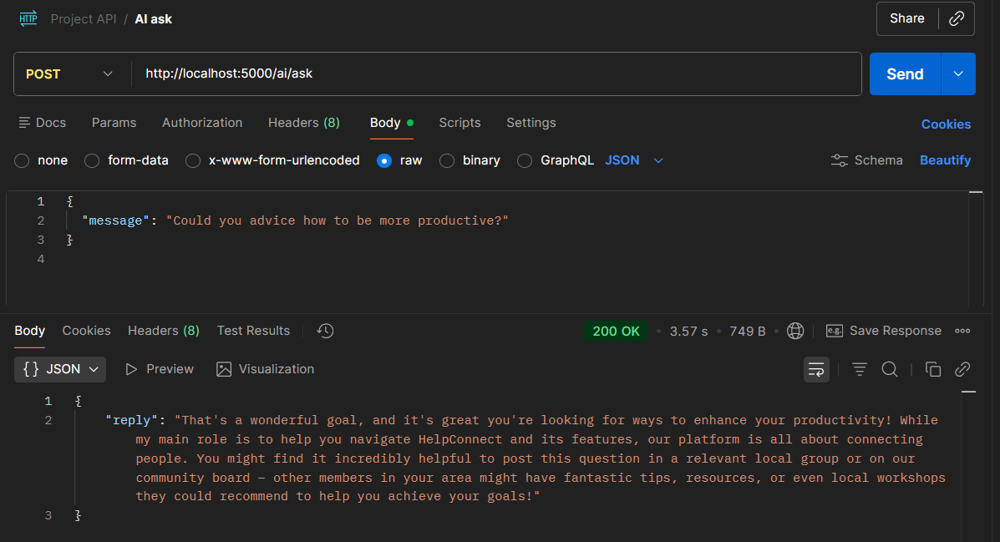

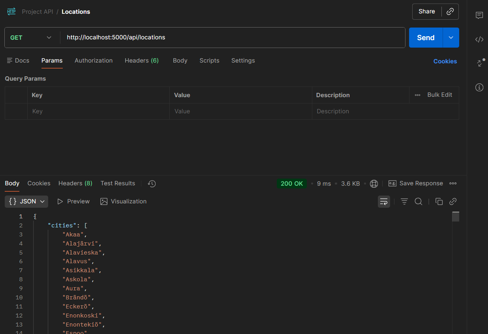

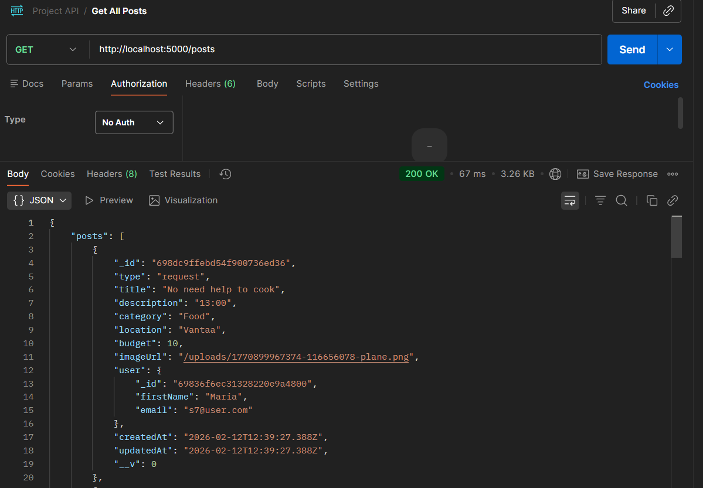

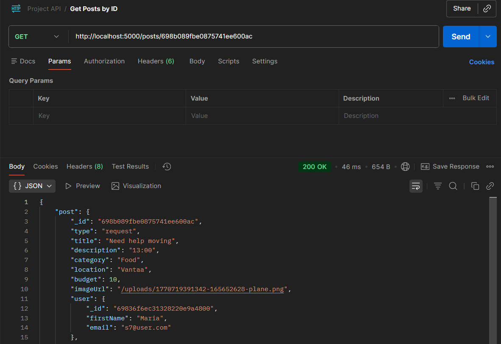

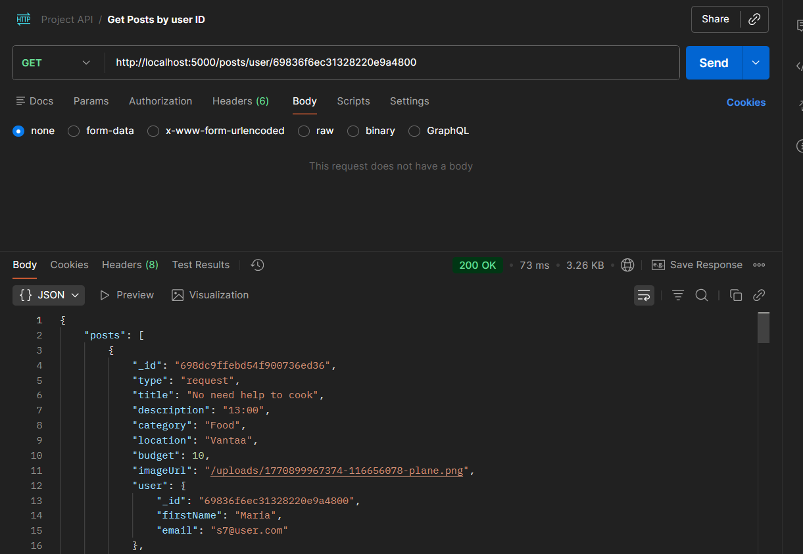

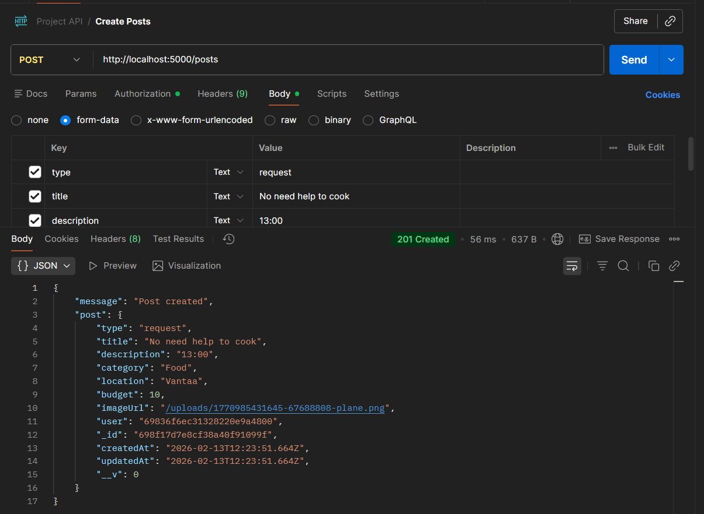

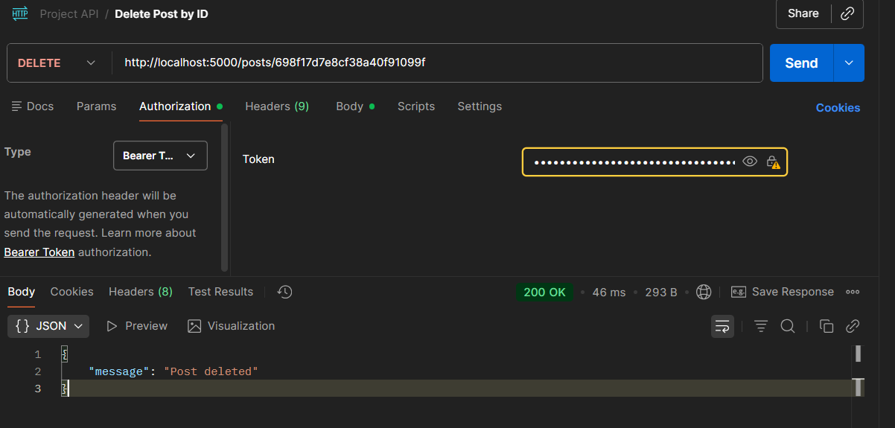

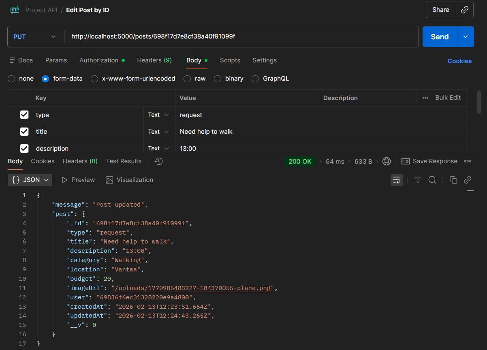

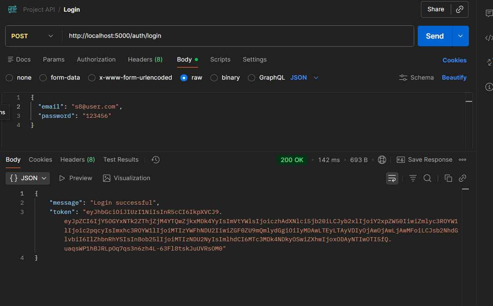

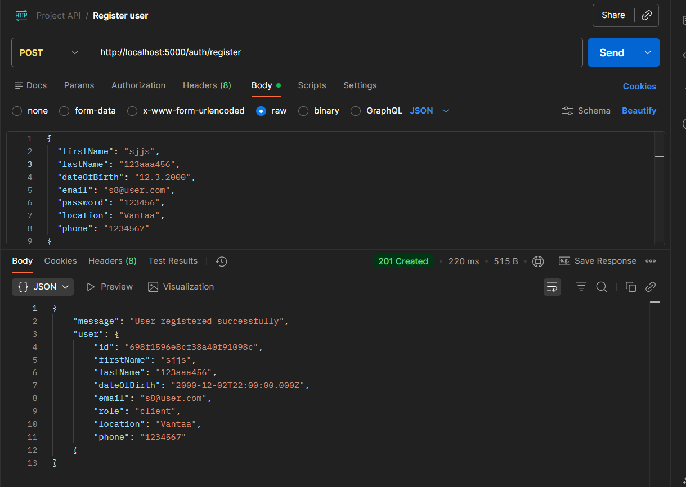

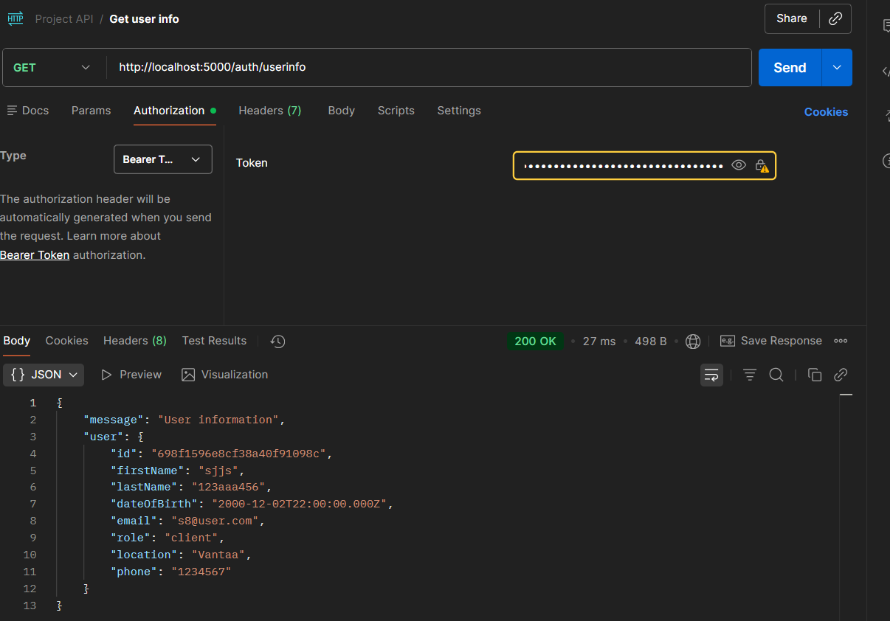

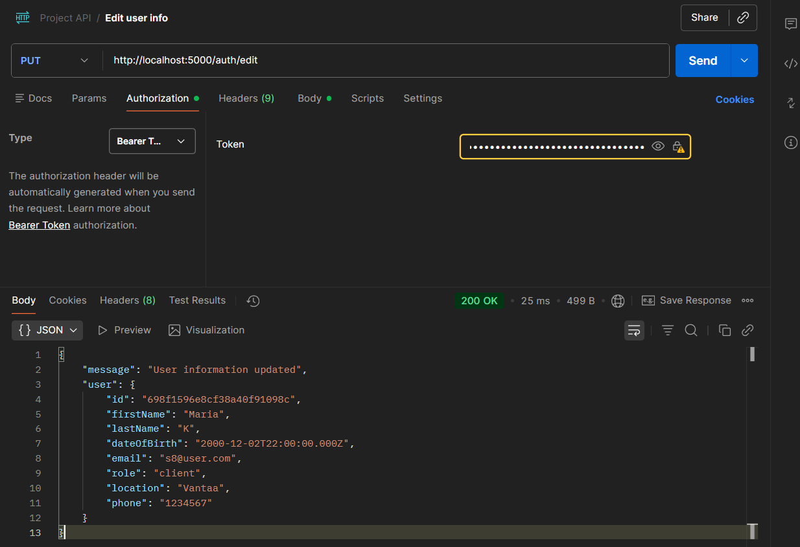

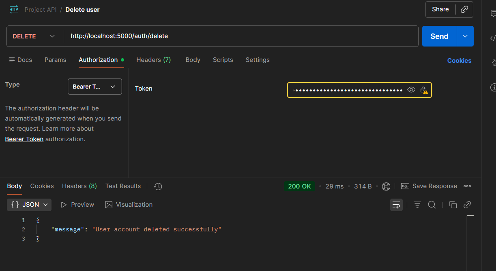

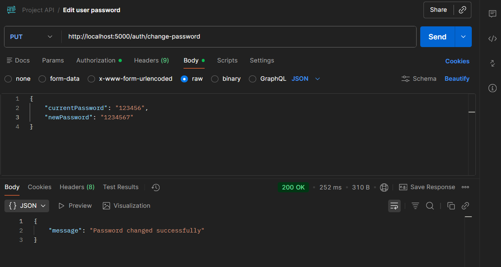